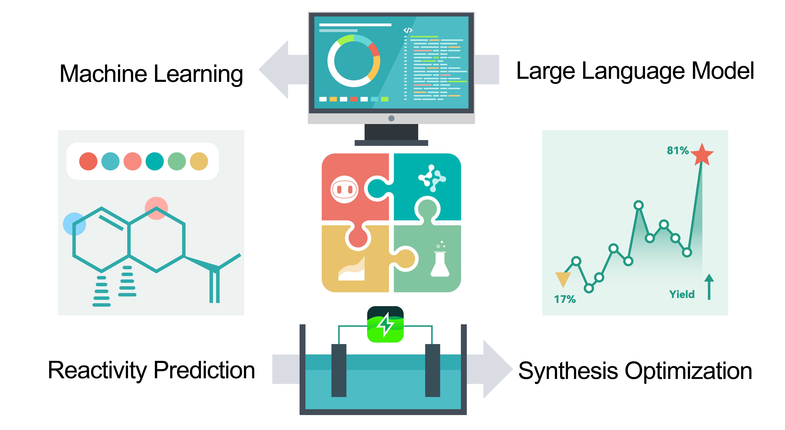

# ML + LLM for Electrochemical Reactions 




This repository contains code and datasets associated with the research preprint **[Integrating Machine Learning and Large Language Models to Advance Exploration of Electrochemical Reactions](https://chemrxiv.org/engage/chemrxiv/article-details/66cf7e1120ac769e5f241caf)**. This project demonstrates the synergistic potential of machine learning (ML) and large language models (LLMs) for the exploration, prediction, and optimization of electrochemical C-H oxidation reactions.

## Overview

In this study, we developed a framework combining ML and LLMs to facilitate rapid screening of electrochemical reactions, predict substrate reactivity, and optimize reaction conditions. The repository provides:
- Code for literature analysis using LLMs to assign Yes/No label based on prompt and give justifications.
- ML models and code to predict reactivity and site selectivity of C-H oxidation reactions.
- Datasets from both experimental results and literature mining.

## Repository Structure

### 1. `literature_analysis`
This folder contains code and data related to the semantic analysis of scientific literature, utilizing LLMs to extract relevant information for electrochemical C-H oxidation reactions.
- **SF1. Literature Screening Dataset.xlsx**: Contains summarized results and DOI links to the PDFs associated with this study.
- **analysis_prompt.json**: A JSON file containing the prompts used for LLM analysis.
- **llm_analysis.py**: Python script to process PDFs with OpenAI GPT-4. It extracts and cleans text from PDF files, limits token length, and sends it to the LLM for analysis.

### 2. `llm_coding`
This folder contains the core ML and LLM interaction code for predicting reaction outcomes and optimizing synthesis conditions.
- **SF3. Auto Coding Dataset.xlsx**: Dataset generated through LLMs for auto-coding ML tasks.
- **echem_train.xlsx** & **echem_test.xlsx**: Training and test datasets used for ML models related to electrochemical C-H oxidation reactions.
- **llm_ml_coding.py**: A script for interacting with various LLMs (GPT-4, Claude, LLaMA) to generate and execute Python code for ML tasks.
- **llm_edbo_coding.py** & **llm_skopt_coding.py**: Similar to `llm_ml_coding.py`, these scripts are for generating code for synthesis optimization tasks.
- **prompts.json**: Contains specific prompts used by the LLMs to generate machine learning and optimization code.

### 3. `screening`
This folder contains trained machine learning models used for electrochemical reaction screening.
- **trained chemprop models**: Includes models for reactivity and selectivity prediction.
- **classical ML models**:
- **SF2. EChem Reaction Screening Dataset.xlsx**: Dataset containing experimental screening results.
- **classical ML.py**: Python script to interact with classical ML models for predicting reaction outcomes.

### 4. `results`
This folder contains the final datasets and results generated during this study.
- **SF1. Literature Screening Dataset.xlsx**: Dataset from the literature analysis phase.
- **SF2. EChem Reaction Screening Dataset.xlsx**: Results from reaction screening.
- **SF3. Auto Coding Dataset.xlsx**: Dataset generated from LLM-guided code generation.
- **SF4. EChem Reaction Optimization Dataset.xlsx**: Results from the reaction optimization process.


## Evaluation Summary

In this study, 12 large language models (LLMs) were tasked with chemistry-related tasks. Each model was repeated for 100 times. All generated code and their evaluations can be found in **SF3. Auto Coding Dataset.xlsx**.
Below is a summary of three representative tasks:

- **Task 1: Reactivity Prediction** – Implemented ML models for predicting chemical reactivity with sklearn.
  - Top models like **Claude-3.5-sonnet**, **Claude-3-opus**, and **GPT-4o** achieved high code correctness and accuracy, with over **96%** ML model performance.
  
- **Task 2: Bayesian Optimization** – Focused on using skopt for suggesting optimal synthesis conditions using Bayesian optimization.
  - Models such as **GPT-4o** and **O1-preview** excelled with high correctness and accuracy after reflection.

- **Task 3: EDBO Optimization** – Involved reading synthesis condition documentation and applying the EDBO Python package for optimization. (https://github.com/doyle-lab-ucla/edboplus)
  - Models like **Claude-3.5-sonnet** and **GPT-4o** demonstrated over **98%** correctness and accuracy, efficiently utilizing the EDBO package for optimization tasks.

### Task 1: Generating Code for Reactivity Prediction

| **Model Name**       | **Avg Time (sec)** | **Code Length** | **Code Correctness** | **Correctness (with Reflection)** | **Code Accuracy** | **ML Model Performance** |
|----------------------|--------------------|-----------------|----------------------|----------------------------------|-------------------|--------------------------|
| llama-3              | 24                 | 218             | 54%                  | 76%                              | 72%               | 96%                      |
| llama-3.1            | 25                 | 224             | 52%                  | 89%                              | 80%               | 92%                      |
| claude-3-sonnet      | 16                 | 165             | 75%                  | 91%                              | 89%               | 95%                      |
| claude-3-opus        | 37                 | 188             | 84%                  | 100%                             | 99%               | 96%                      |
| claude-3.5-sonnet    | 14                 | 216             | 100%                 | 100%                             | 99%               | 96%                      |
| gpt-3.5-turbo        | 7                  | 189             | 75%                  | 90%                              | 88%               | 95%                      |
| gpt-4o-mini          | 9                  | 243             | 60%                  | 91%                              | 90%               | 96%                      |
| gpt-4-0613           | 29                 | 180             | 70%                  | 98%                              | 92%               | 95%                      |
| gpt-4-turbo          | 19                 | 209             | 86%                  | 99%                              | 99%               | 96%                      |
| gpt-4o               | 11                 | 218             | 92%                  | 100%                             | 99%               | 96%                      |
| o1-mini              | 25                 | 249             | 94%                  | 100%                             | 100%              | 96%                      |
| o1-preview           | 37                 | 244             | 91%                  | 100%                             | 100%              | 96%                      |

### Task 2: Synthesis Condition Suggestion via Bayesian Optimization

| **Model Name**       | **Avg Time (sec)** | **Code Length** | **Code Correctness** | **Correctness (with Reflection)** | **Code Accuracy** |
|----------------------|--------------------|-----------------|----------------------|----------------------------------|-------------------|
| llama-3              | 28                 | 476             | 1%                   | 9%                               | 8%                |
| llama-3.1            | 22                 | 471             | 6%                   | 16%                              | 15%               |
| claude-3-sonnet      | 22                 | 514             | 0%                   | 18%                              | 14%               |
| claude-3-opus        | 39                 | 424             | 18%                  | 60%                              | 56%               |
| claude-3.5-sonnet    | 15                 | 450             | 5%                   | 48%                              | 41%               |
| gpt-3.5-turbo        | 8                  | 322             | 20%                  | 52%                              | 34%               |
| gpt-4o-mini          | 12                 | 560             | 5%                   | 27%                              | 27%               |
| gpt-4-0613           | 33                 | 419             | 18%                  | 42%                              | 30%               |
| gpt-4-turbo          | 30                 | 468             | 26%                  | 66%                              | 64%               |
| gpt-4o               | 16                 | 548             | 43%                  | 79%                              | 75%               |
| o1-mini              | 23                 | 764             | 35%                  | 75%                              | 74%               |
| o1-preview           | 66                 | 661             | 50%                  | 90%                              | 85%               |

### Task 3: Reading and Using EDBO Optimization

| **Model Name**       | **Avg Time (sec)** | **Code Length** | **Code Correctness** | **Correctness (with Reflection)** | **Code Accuracy** |
|----------------------|--------------------|-----------------|----------------------|----------------------------------|-------------------|
| llama-3              | 10                 | 121             | 90%                  | 90%                              | 76%               |
| llama-3.1            | 9                  | 105             | 98%                  | 98%                              | 98%               |
| claude-3-sonnet      | 12                 | 176             | 95%                  | 95%                              | 94%               |
| claude-3-opus        | 26                 | 219             | 90%                  | 98%                              | 94%               |
| claude-3.5-sonnet    | 11                 | 336             | 98%                  | 99%                              | 99%               |
| gpt-3.5-turbo        | 6                  | 205             | 28%                  | 54%                              | 52%               |
| gpt-4o-mini          | 6                  | 271             | 80%                  | 81%                              | 81%               |
| gpt-4-0613           | 25                 | 249             | 80%                  | 94%                              | 92%               |
| gpt-4-turbo          | 30                 | 374             | 76%                  | 96%                              | 94%               |
| gpt-4o               | 11                 | 368             | 92%                  | 98%                              | 94%               |
| o1-mini              | 25                 | 358             | 79%                  | 98%                              | 98%               |
| o1-preview           | 36                 | 285             | 91%                  | 100%                             | 99%               |


*Note: Code correctness refers to the percentage of code that executes without errors after 100 trials. Code accuracy is the successful execution of code that achieves the intended result, such as generating a model with over 85% accuracy. Higher correctness and accuracy often indicate fewer hallucinations. Reflection, with up to two corrections, is applied to improve code. Average time measures the total response time for generating the code, including comments.*

## Requirements

### Python Libraries
Install the following dependencies before running the scripts:
```bash
pip install pandas PyPDF2 tiktoken openai anthropic replicate rdkit numpy
```

### API Keys
The code interacts with several LLMs (GPT, Claude, LLaMA). You will need API keys from OpenAI, Anthropic, and Replicate to execute these scripts. The scripts will prompt for these keys when necessary.

## Usage

### Literature Analysis
To process and analyze literature data:
1. Place the relevant PDFs in a folder.
2. Ensure the `analysis_prompt.json` file is available in the working directory.
3. Run the `llm_analysis.py` script to analyze the PDFs. The results will be saved in CSV format.

```bash
python literature_analysis/llm_analysis.py
```

### Machine Learning Model Training
For training and testing ML models on the provided datasets:
1. Review the datasets in `echem_train.xlsx` and `echem_test.xlsx`.
2. Use the `llm_ml_coding.py` script to generate code for ML tasks via LLM interactions.

```bash
python llm_coding/llm_ml_coding.py
```

### Reaction Screening and Optimization
To perform screening and optimization of reaction conditions:
1. Use the `screening_analysis.py` script to analyze screening data.
2. The `llm_edbo_coding.py` and `llm_skopt_coding.py` scripts can be used for generating and evalauting synthesis optimization tasks similar to `llm_ml_coding.py`.

## Results

The results from running the LLM-guided code generation and the subsequent execution of ML tasks are stored in the `results` folder. Summary files include:
- **results.csv**: Output of the screening and optimization processes.
- **summary.xlsx**: Summary of the performance of different LLMs in code generation and ML task execution.


## License 

The input prompt generation script is distributed under the MIT open source license (see [`LICENSE.txt`](LICENSE.txt))


## Contributing

If you have any questions/comments/feedback, please feel free to reach out to any of the authors.


## Acknowledgements

This material is based upon work supported by Pfizer.
We extend our gratitude to the Machine Learning for Pharmaceutical Discovery and Synthesis Consortium for their support.

## References
For this work:

> ChemRxiv <br/>
> Integrating Machine Learning and Large Language Models to Advance Exploration of Electrochemical Reactions <br/>
> [https://arxiv.org/abs/2303.08774](https://doi.org/10.26434/chemrxiv-2024-pk105-v2) <br/>


For GPT-4: 

> GPT-4 Technical Report <br/>
> OpenAI <br/>
> https://arxiv.org/abs/2303.08774 <br/>

# echem
